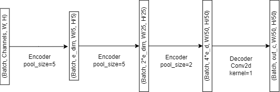
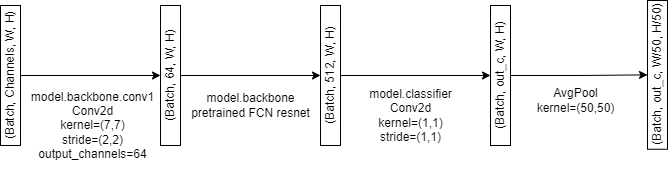
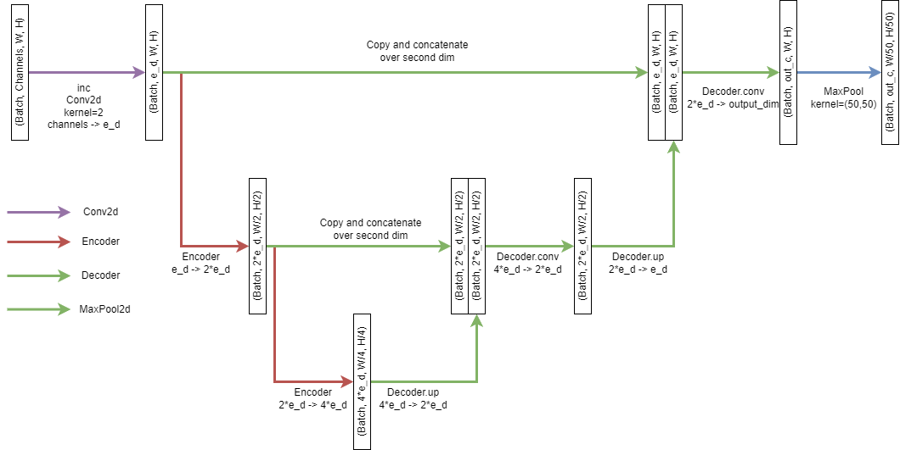

# HW03: Semantic Segmentation and Model Monitoring
TODO - Update your team name tagging all contributors by first and lastname
TODO - Add the following badges
- PyTorch
- PyTorch Lightning
- NumPy
- Weights and Biases
- Scikit Learn

## Assignment Overview
In this homework we will:
- [ ] Create a baseline deep learning model for semantic segmentation by:
  - [ ] Building a simple CNN segmentation model from scratch.
  - [ ] Use the pre-trained FCNResnet101 to transfer learn the segmentation task on remote sensing data.
  - [ ] Build a UNet segmentation model to experiment with skip connection networks.
- [ ] Use PyTorch Lightning to simplify and decouple training and validation loops. 
- [ ] Monitor model training using Weights and Biases
- [ ] Perform hyperparameter sweeps to select best model hyperparameters.
- [ ] Perform validation to evaluate segmentation task performance using:
  - [ ] Jaccard Index
  - [ ] Intersection over Union
  - [ ] Accuracy
  - [ ] AUC: Area under the Receiver Operator Curve (ROC)
  - [ ] F1-score
- [ ] Profit :moneybag:

## Necessary Files from Last Assignment
- `src/preprocessing/file_utils.py`
- `src/preprocessing/preprocess_sat.py`
- `src/preprocessing/subtile.py`
- `src/esd_data/augmentations.py`
- `src/esd_data/dataset.py`
- `src/esd_data/datamodule.py`

## Files to Work On
- `src/models/supervised/segmentation_cnn.py`
- `src/models/supervised/resnet_transfer.py`
- `src/models/supervised/unet.py`
- `src/models/supervised/satellite_module.py`
- `scripts/train.py`
- `scripts/evaluate.py`
- `scripts/sweeps.yml`

## Images to Save and Inspect
- Visualization of restitched ground truth and predictions from `scripts/evaluate.py`
- Reconstructed 16x16 predictions for each model architecture in `data/predictions/<modelname>`
  
## Weights and Biases
There are no local tests in this assignment. Please make sure you log all necessary information with respect to model training and validation using student team accounts on Weights and Biases to assist you in selecting best hyperparameters. To create an account and team go to: [wandb.ai](http://wandb.ai).

# Modeling
### The PyTorch `nn.Module`
Creating a model in pytorch is based on the `torch.nn.Module` class. Each of these modules represent part of a neural network and are meant to be reusable and composable components that can easily be arranged to create different architectures. In order to compose these, you may inherit from a `Module` or include a `Module` inside another `Module`'s class variables. When this is done, the outer `Module` registers all the inner `Module`'s parameters as its own, letting you perform gradient descent without needing to explicitly calculate the derivative.  

Although modeling from scratch is generally more expensive in terms of computational resources and time, it is good to know how to do it if you need to. Notice that we must inherit from the PyTorch nn.Module to define your model. In this derived class we must implement the __init__ function and the forward function. The constructor allows use to define the layer architecture comprising of convolutional, pooling, and fully connected layers. The forward method chains the layers together with activation functions retrieved from PyTorch's torch.nn.functional library.

- `__init__`
- `forward`

### PyTorch Lightning Module
To remove the overhead of boilerplate code that often pollutes the main functions of many a naive machine learning researcher, PyTorch Lightning provides an organized way of approaching the training and validation loop. By inheriting from pl.LightningModule you can create a class that calls the model defined using nn.Module with additional Accuracy metrics in the __init__. In addition to __init__ you must also implement the following member functions:

- `forward`
- `training_step`
- `validation_step`
- `configure_optimizers`

For more information on how to use PyTorch Lightning with PyTorch as well as helpful tutorials, see:
- [PyTorch Lightning: Basic Skills](https://lightning.ai/docs/pytorch/latest/levels/core_skills.html)
- [A Recipe for Training Neural Networks](http://karpathy.github.io/2019/04/25/recipe/)

### Segmentation CNN
This model represents a single feedforward CNN which works as a funnel to lower the resolution down to our segmentation's resolution. Each encoder does 2 convolutions, followed by a `MaxPool2d` operation which reduces the resolution of the image, at the same time, each encoder will increase the number of channels by 2, starting from `embedding_size`. This encoder is used 3 times, the first one lowers the resolution from WxH to W/5xH/5, the second one to W/25xH/25 and the third one to W/50xH/50. For example, if you are using a 200x200 subtile size, this will result in a prediction mask of size 4x4, which should correspond to the size of the image. A final decoder then takes the resulting channels and uses a 1x1 convolution to lower them down to the number of classes, creating logits for each class.

### Transfer Resnet101
This model tries to leverage a pretrained model used for another task. While the task is completely different, many layers in the neural network are similar between related tasks, meaning that the gradient descent process is easier since most layers are pre-trained with similar solutions. Both tasks, however, use different kinds of images, requiring you to replace some layers to make them compatible. Namely, the first layer in an FCNResnet101 is meant to be used for RGB images, meaning that you will need to change this layer to allow for the number of satellite channels. This can easily be done in PyTorch though, by simply assigning the layer with a new layer, for example, `model.backbone.conv1 = nn.Conv2d(...)` will replace the layer with a new one of your choice. The other layer that needs to be changed is the last one, `model.classifier`, which needs to be changed so that the number of channels matches the number of prediction classes.

Finally, an `AvgPool2d` layer must be added at the end, this is because FCNResnet is meant to be used in segmentation problems where the resolution of the images is the same as the resolution of the masks, however, as we don't have that luxury, the next best thing is to average a 50x50 patch in order to get the average prediction of all the pixels.

### U-Net
This model uses what is called a "skip connection", these are inspired by the nonlinear nature of brains, and are generally good at helping models "remember" informatiion that might have been lost as the network gets longer. These are done by saving the partial outputs of the networks, known as residuals, and appending them later to later partial outputs of the network. In our case, we have the output of the `inc` layer, as the first residual, and each layer but the last one as the rest of the residuals. Each residual and current partial output are then fed to the `Decoder` layer, which performs a reverse convolution (`ConvTranspose2d`) on the partial output, concatenates it to the residual and then performs another convolution. At the end, we end up with an output of the same resolution as the input, so we must `MaxPool2d` in order to make it the same resolution as our target mask.

## Training
We will train the models using the model architectures defined above in conjunction with the PyTorch Lightning Module for ease of running the training step in `train.py.` To monitor model training make sure to make an account with Weights and Biases for yourself and then create a team. For details on how to get started see [How to Use W&B Teams For Your University Machine Learning Projects for Free](https://wandb.ai/ivangoncharov/wandb-teams-for-students/reports/How-to-Use-W-B-Teams-For-Your-University-Machine-Learning-Projects-For-Free---VmlldzoxMjk1Mjkx).

### `ESDConfig` Python Dataclass
In `src/utilities.py` we have created an `ESDConfig` dataclass to store all the paths and parameters for experimenting with the training step. If you notice, in the main function of `scripts/train.py`, `scripts/evaluate.py`, and `scripts/train_sweeps.py` we have provided you with code that utilize the library `argparse` which takes command line arguments using custom flags that allow the user to overwrite the default configurations defined in the dataclass we provided. When running train, for example, if you would like to run training for the architecture `SegmentationCNN` for five epochs you would run:

`python -m scripts.train --model_type=SegmentationCNN --max_epochs=5`

Here is more information on [`argparse`](https://docs.python.org/3/howto/argparse.html).

### Hyperparameter Sweeps
We will be using Weights and Biases Sweeps by configuring a yaml file called `sweeps.yml` in order to automate hyperparameter search over metrics such as batch size, epochs, learning rate, and optimizer. You may also experiment with the number of encoders and decoders you would like to add to your model architecture given that you are sensitive to the dimensions of your input image and the dimensions of the output prediction with respect to the ground truth. Some useful articles on how to perform sweeps and use the information to choose the best hyperparameter settings for your model can be found:
- [Tune Hyperparameters](https://docs.wandb.ai/guides/sweeps)
- [Running Hyperparameter Sweeps to Pick the Best Model](https://wandb.ai/wandb_fc/articles/reports/Running-Hyperparameter-Sweeps-to-Pick-the-Best-Model--Vmlldzo1NDQ0OTIy)

To run training with the hyperparameter sweeps you define in `sweeps.yml` please run `train_sweeps.py --sweep_file=sweeps.yml` provided for you.

## Validation
You will run validation using the script `evaluate.py` where you will load the model weights from the last checkpoint and make a forward pass through your model in order to generate prediction masks. Use `ESDConfig` dataclass in `utilities.py` to set the default configuration for the validation loop when arguments are not passed via command line.

### Visualization: Restitching Predictions to Compare with Ground Truth
`evaluate.py` calls functions in `visualization/restitch_plot.py` which restitches the predicted subtiles and groundtruth back to the original 16x16 dimensions for plotting purposes using the same colormap as defined in the IEEE GRSS ESD 2021 Competition.

## NOTE
- When experimenting with different generated subtile dimensions from calling the `prepare_data` method from the Lightning datamodule, you may need to delete the preprocesing directory.
- It is required that you add your team and individual names along with pertinent badges to your readme.
- Check the wandb logs to verify the correctness of your program.
- The initial code will not work. You will have to write the necessary code and fill in the gaps.
- Commit all changes as you develop the code in your individual private repo. Please provide descriptive commit messages and push from local to your repository. If you do not stage, commit, and push git classroom will not receive your code at all which will affect your final Gradescope submission.
- Make sure your last push is before the deadline. Your last push will be considered as your final submission.
- There is no partial credit for code that does not run.
- If you need to be considered for slip days please fill the Google [form request](https://forms.gle/drE8kYoNhLueZsYW7). If you have any additional concerns, please message the staff on Ed before the deadline. Late requests may not be considered.

### References
[Overview of Semantic Segmentation](https://www.jeremyjordan.me/semantic-segmentation/)
[Cook Your First UNET in Pytorch](https://towardsdatascience.com/cook-your-first-u-net-in-pytorch-b3297a844cf3)

### Authors
@nadia-eecs
@erobl
@Drew-1771
@campjake